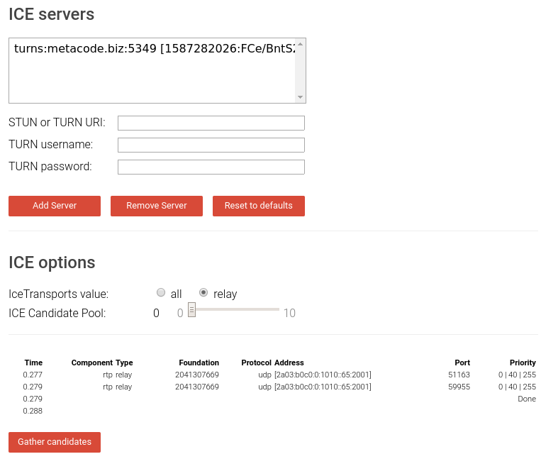

# Coturn docker deployment

Replace all `CUSTOMIZE THIS` strings inside the config and run with `docker-compose up -d`.

As for Prosody side see https://prosody.im/doc/coturn

See https://gist.github.com/iNPUTmice/a28c438d9bbf3f4a3d4c663ffaa224d9#av-calls-in-conversations for more technical details.

## ejabberd

Subscribe to this ticket: https://github.com/processone/ejabberd/issues/2947

## Prosody

Make sure you have `mod_turncredentials` installed from prosody-modules repository (see https://prosody.im/doc/installing_modules) and it's the latest version. This is **important** as there were [compatibility fixes](https://hg.prosody.im/prosody-modules/rev/bbfcd786cc78) merged upstream on 18.04.2020.

You can check if you got this part right via CAAS: https://compliance.conversations.im/test/stun/ and https://compliance.conversations.im/test/turn/ or via local installation: https://github.com/iNPUTmice/caas

If CAAS tests fail check if you updated your Prosody modules.

Alternatively use XML console (replace `shakespeare.lit` with your own domain):

```xml
<iq
    id='ul2bc7y6'
    to='shakespeare.lit'
    type='get'>
  <services xmlns='urn:xmpp:extdisco:2'/>
</iq>
```

Response should contain two STUN and two TURN servers for Prosody.

If you have **battery saver module** installed update it too from upstream ([patch](https://hg.prosody.im/prosody-modules/rev/19c5bfc3a241)).

## Checking TURN

This checks if your coturn server is configured correctly.

https://webrtc.github.io/samples/src/content/peerconnection/trickle-ice/

Remove all servers.

Insert your stun server there: `stun:example.com:3478` (replace domain and port name).

Get credentials using XML console like in the previous step and insert the TURN server: `turn:example.com:3478` select `relay` checkbox and click Gather candidates. You should get some `relay` components.



Site output should contain several Type = relay components.

## Checking TURN in Conversations

Get adb running on one phone and grep for `relay`:

```
$ adb -d logcat -v time -s conversations | grep relay
sending candidate: audio:0:candidate:700011408 1 udp 41888255 ... 52256 typ relay raddr ... rport 46819 generation 0 ufrag VDdO network-id 3 network-cost 900:turn:...:3478?transport=udp:UNKNOWN
sending candidate: video:1:candidate:700011408 1 udp 41888255 ... 49581 typ relay raddr ... rport 59079 generation 0 ufrag VDdO network-id 3 network-cost 900:turn:...:3478?transport=udp:UNKNOWN
sending candidate: video:1:candidate:1731899232 1 udp 25110783 ... 50680 typ relay raddr ... rport 60907 generation 0 ufrag VDdO network-id 3 network-cost 900:turn:...:3478?transport=tcp:UNKNOWN         , sb=true
sending candidate: audio:0:candidate:1731899232 1 udp 25110783 ... 52082 typ relay raddr ... rport 56856 generation 0 ufrag VDdO network-id 3 network-cost 900:turn:...:3478?transport=tcp:UNKNOWN         1:
received candidate: audio:0:candidate:700011408 1 udp 41888255 ... 63762 typ relay raddr ... rport 56152 generation 0 ufrag /zqy::UNKNOWN
received candidate: audio:0:candidate:2721783836 1 udp 41820159 ... 51130 typ relay raddr ... rport 41410 generation 0 ufrag /zqy::UNKNOWN
remote candidate selected: :-1:candidate:700011408 1 udp 41888255 ... 63762 typ relay raddr ... rport 56152 generation 0 ufrag /zqy::UNKNOWN
```

Ideally it should have `selected` candidate with `typ relay`. Try to get phones behind NAT (two different WiFi networks or one mobile one WiFi).

